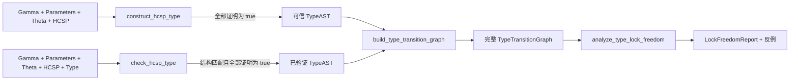

# 公共接口使用手册

本文面向只想调用项目功能、而不需要直接构造内部 AST 或判断对象的用户。项目根包
只承诺四个业务函数：

本文负责解释怎样调用接口、读取返回值和处理异常；它不以接口摘要代替内部语义。
需要了解解析、符号执行、Table 2/3 推导和证明阶段具体做了什么，请阅读
[当前代码的实现语义与论文规则落地方式](IMPLEMENTATION_SEMANTICS.md)。

```python
from hcsp_typechecker import (
    construct_hcsp_type,
    check_hcsp_type,
    build_type_transition_graph,
    analyze_type_lock_freedom,
)
```

四个函数分别完成“从 HCSP 构造 Type”“检查用户 Type”“从 Type 构造 Table 3
状态图”“在完整图上检查死锁/活锁自由”。它们都支持
`output="none" | "result" | "full"`，但输入和成功结果不同。

## 1. 四个接口之间的数据流



Constructor 与 Checker 都在内部解析 HCSP、Gamma、Theta 和参数。它们不会向普通
调用者返回 Process AST。图接口只接收已经存在的正式 `TypeAST`，不接收 HCSP 文本
或用户 Type 文本。锁分析接口只接收第三接口已经生成的完整图。

## 2. 最短可运行示例

### 2.1 构造 Type

```python
from hcsp_typechecker import construct_hcsp_type

source = """
gamma(x: Int)
theta(ch: channel(value: Int))
process {{ch?(x); ch!(x)}}
"""

type_ast = construct_hcsp_type(source, output="result")
```

正常返回说明：输入已成功转换为内部 Process AST，Table 2 规则已形成完整 Type，
并且所有必要的一阶逻辑和 dL 证明义务均为 `true`。

### 2.2 检查用户 Type

```python
from hcsp_typechecker import check_hcsp_type

typed_source = """
gamma(x: Int)
theta(ch: channel(value: Int))
process {{ch?(x); ch!(x)}}
type forever interrupt angelic {
    ch? -> forever interrupt angelic {
        ch! -> empty
    }
}
"""

checked = check_hcsp_type(typed_source, output="result")
```

Checker 直接把用户 Type 当作规则结论逐层检查，不先运行 Constructor 再比较两棵
完整树。正常返回的 `checked` 就是 `type` 分节解析出的正式 AST。

### 2.3 构造状态图

```python
from hcsp_typechecker import build_type_transition_graph

graph = build_type_transition_graph(type_ast, output="result")
print(graph.initial_state)
print(len(graph.states), len(graph.transitions))
```

图接口先对 Type 做单向规范化和等递归状态取商，再生成 Table 3 关键-deadline
约化下的完整可达闭包。

## 3. Constructor 接口

```python
construct_hcsp_type(
    source: str,
    *,
    source_name: str = "<input>",
    initial_states=None,
    path_condition: str | bool = True,
    output: OutputMode | str = "none",
    stream=None,
    z3_timeout_ms: int = 5000,
    keymaerax_timeout_seconds: float | None = None,
) -> TypeAST
```

### 3.1 `source`

Constructor 输入固定为：

```ebnf
constructor_source ::= gamma [parameters] theta process EOF
```

最小输入是 `gamma() theta() process {{skip}}`。各分节含义如下：

| 分节 | 作用 | 是否必写 |
|---|---|---|
| `gamma(...)` | 声明状态变量基础类型和允许出现的 ODE 左端变量集合 | 是，可为空 |
| `parameters(...) where(H)` | 声明所有分量共享、执行期间只读的参数及背景约束 | 否 |
| `theta(...)` | 声明通道槽位、槽位 binder 和联合 refinement | 是，可为空 |
| `process {...}` | 一个或多个顶层 HCSP 顺序分量；多个分量表示并行系统 | 是且非空 |

完整语法分别见[上下文语法](GAMMA_THETA_INPUT_SYNTAX.md)与
[Process/表达式语法](HCSP_INPUT_SYNTAX.md)。

### 3.2 `initial_states`

初态是 Gamma 标量变量上的部分赋值，不要求给出所有变量：

```python
# 一个顶层 Process
construct_hcsp_type(source, initial_states={"x": 0, "ready": False})

# 两个顶层并行分量，顺序与 process { {P1}, {P2} } 一致
construct_hcsp_type(source, initial_states=({"x": 0}, {"y": 1}))
```

允许的键是 Gamma 中映射到 `Bool/Nat/Int/Rational/Real` 的变量。未知变量、参数名和
`continuous(...)` 声明标签都不是状态键。并行时 mapping 数量必须与顶层分量数
完全相同；接口不会猜测怎样拆分一个全局状态 mapping。

### 3.3 `path_condition`

路径条件可以是 Python `True/False`，也可以是项目表达式字符串：

```python
construct_hcsp_type(
    source,
    path_condition="x >= 0 and x <= limit",
)
```

字符串使用与 HCSP 公式相同的严格表达式解析器，并可引用 Gamma 标量和共享参数。
字符串语法错误属于 `HCSPInputError`；传入 list 等非字符串、非 bool 对象属于 Python
调用契约错误，抛 `TypeError`。

### 3.4 成功、否证与未决

Constructor 使用三值证明结论，但公共返回协议不会把它们混在一起：

| 内部结论 | 是否形成完整 Type | 公共行为 |
|---|---:|---|
| `true` | 是 | 正常返回可信 `TypeAST` |
| `false` | 任意 | 抛 `HCSPTypeConstructionError` |
| `unknown` | 否 | 抛 `HCSPTypeConstructionError` |
| `unknown` | 是 | 抛 `HCSPUntrustedTypeConstructionError`，候选在 `untrusted_type` |

证明器返回 `unknown` 后，Constructor 会记录义务并继续规则推导；因此它可能仍形成
完整候选。候选只适合审计或外部补证，不能当作已经证明的成功返回值。

## 4. Checker 接口

```python
check_hcsp_type(
    source: str,
    *,
    source_name: str = "<input>",
    initial_states=None,
    path_condition: str | bool = True,
    output: OutputMode | str = "none",
    stream=None,
    z3_timeout_ms: int = 5000,
    keymaerax_timeout_seconds: float | None = None,
) -> TypeAST
```

Checker 的调用参数与 Constructor 相同，但 source 末尾必须再有一个 `type` 分节：

```ebnf
checking_source ::= gamma [parameters] theta process type EOF
```

Type 输入语法见[用户 Type 输入语法](TYPE_INPUT_SYNTAX.md)。尤其要注意：

- `internal` 的每个当前层分支必须显式加圆括号，圆括号决定它对应哪个 Process
  内部选择分支；
- `angelic { ... }` 可以为空，也可以包含一到多个有序通信分支；
- `empty` 是正常无通信行为，`bottom` 是不可达后继，两者不能互换；
- 并行 Type 的分量数量和顺序必须与顶层 Process 分量一致；
- Checker 不用交换律或结合律搜索另一种 Type 括号结构。

Checker 遇到证明 `unknown` 时会继续检查余下 Type 结构，以提供尽可能完整的报告，
但最终仍抛 `HCSPTypeCheckingError(kind="proof-unknown")`。与 Constructor 不同，
Checker 没有“交付一个不可信新类型”的职责。

## 5. 状态图接口

```python
build_type_transition_graph(
    type_ast: TypeAST,
    *,
    max_states: int | None = None,
    max_transitions: int | None = None,
    output: OutputMode | str = "none",
    stream=None,
) -> TypeTransitionGraph
```

### 5.1 返回对象

`TypeTransitionGraph` 是不可变对象，包含：

| 字段/方法 | 含义 |
|---|---|
| `initial_state: int` | 初始状态编号 |
| `states: tuple[TypeState, ...]` | 按 `0..n-1` 连续编号的状态 |
| `transitions: tuple[TypeTransition, ...]` | 已去重的全部可达边 |
| `outgoing(state_id)` | 按稳定顺序返回指定状态的所有出边 |

`state.type_ast` 是用于输出的规范 Type AST。`edge.label` 是无耗时 `tau` 标签或携带
精确时长与 ready set 的时间标签；`edge.derivations` 保存产生同一源/标签/目标边的
所有不同 Table 3 规则证据。图不混入性质结论；第四接口单独产生锁自由报告。

### 5.2 规模限制

```python
graph = build_type_transition_graph(
    type_ast,
    max_states=10_000,
    max_transitions=50_000,
)
```

两个上限必须是严格正整数或 `None`。一旦触及上限，接口抛
`HCSPTypeTransitionGraphError(kind="size-limit")`，并且不返回部分图。这样调用者
不会把尚未穷尽的前缀误认为完整状态空间。

## 6. 锁自由分析接口

```python
analyze_type_lock_freedom(
    graph: TypeTransitionGraph,
    *,
    output: OutputMode | str = "none",
    stream=None,
) -> LockFreedomReport
```

报告的 `deadlock_free`、`livelock_free` 和 `lock_free` 是稳定布尔属性。性质为假时
接口正常返回，并分别在 `deadlock_witness` 或 `livelock_witness` 中给出有限反例；
输入不是完整图时才抛 `HCSPTypeLockAnalysisError`。详细定义、算法和复杂度见
[死锁/活锁分析](TYPE_LOCK_ANALYSIS.md)。

## 7. 输出模式

四个接口共享同一展示协议：

| `output` | 内容 | 推荐用途 |
|---|---|---|
| `"none"` | 不打印 | 库调用、自动测试、Web 服务 |
| `"result"` | 最终结论、Type、图规模或锁自由摘要、首要错误 | 命令行普通运行 |
| `"full"` | 原始输入、推导/证明轨迹、完整图或锁反例路径 | 人工审计和排错 |

`stream` 可传任何支持 `write()` 的文本流：

```python
from io import StringIO

buffer = StringIO()
type_ast = construct_hcsp_type(source, output="full", stream=buffer)
audit_log = buffer.getvalue()
```

`output="none"` 时，即使失败也不打印；异常对象仍可调用 `format_result()` 或
`format_full()`。不要通过解析中文日志控制程序流程，应读取异常的结构化字段。

## 8. 统一异常处理

```python
from hcsp_typechecker import (
    HCSPInputError,
    HCSPTypeConstructionError,
    HCSPUntrustedTypeConstructionError,
    HCSPTypeCheckingError,
    HCSPTypeTransitionGraphError,
)
```

### 8.1 输入错误

`HCSPInputError` 的核心字段：

| 字段 | 含义 |
|---|---|
| `phase` | `lexical`、`syntax` 或 `validation` |
| `kind` | `input-<phase>` |
| `source_name` | 调用时给出的来源名 |
| `line`, `column` | 从 1 开始的位置 |
| `offset` | 从 0 开始的字符偏移 |
| `found`, `expected` | 实际 token 与期望 token |

`format_diagnostic()` 会生成源码行与插入符。输入错误发生后，Constructor/Checker
后端不会启动。

### 8.2 Constructor 错误

`HCSPTypeConstructionError.kind` 取值：

- `environment`：Gamma、Theta、参数或路径上下文不良构；
- `derivation`：当前 Process 结构无法应用已实现规则形成完整类型；
- `proof-failed`：必要公式被证明为 false 或产生可信反例；
- `proof-unknown`：必要公式未被可信证明器判定。

公共字段包括 `verdict`、`kind`、`phase`、`reason`、`rule`、`location`、
`details` 和 `partial_types`。必须先捕获子类，才能安全读取不可信候选：

```python
try:
    type_ast = construct_hcsp_type(source)
except HCSPUntrustedTypeConstructionError as error:
    candidate = error.untrusted_type
    print(error.format_full())
except HCSPTypeConstructionError as error:
    print(error.kind, error.reason)
```

### 8.3 Checker 错误

`HCSPTypeCheckingError.kind` 取值：`environment`、`type-mismatch`、
`rule-application`、`proof-failed` 或 `proof-unknown`。除通用字段外还提供：

- `expected_type`：用户给出的 Type AST；
- `type_mismatch_detected`：是否明确发现结构不匹配；
- `type_structure_matched`：`True` 表示结构已完整消费，`False` 表示明确不匹配，
  `None` 表示更早的环境/规则失败使检查未走完。

### 8.4 图错误

`HCSPTypeTransitionGraphError.kind` 取值：`invalid-type`、`invalid-limit`、
`normalization` 或 `size-limit`。规模错误额外给出 `limit_name/limit`，非法选项给出
`option_name/option_value`。该异常从不携带部分状态图。

### 8.5 锁分析错误

`HCSPTypeLockAnalysisError.kind` 是 `invalid-graph` 或 `incomplete-graph`；同时公开
`phase`、`reason`、`state_count`、`transition_count` 和 `details`。该异常只描述
分析输入无效。发现死锁或活锁时接口正常返回带见证的 `LockFreedomReport`。

### 8.6 `HCSPErrorDetail`

Constructor 和 Checker 的 `details` 是 `HCSPErrorDetail` 元组。每项含
`category/verdict/message/rule/location`；证明错误还含
`proof_kind/formula/backend_detail`。这是一套面向程序的稳定证据格式，比解析完整
日志可靠。

## 9. 证明器与 `unknown`

Z3 用于表达式、状态和 FOL 义务；KeYmaera X 用于非平凡 ODE 的 dL 义务。若未配置
KeYmaera X，离散程序仍可正常运行，但需要 dL 后端的义务通常得到 `unknown`。

可用环境变量配置证明器：`KEYMAERAX_JAR`、`KEYMAERAX_JAVA`、
`KEYMAERAX_HOME`、`KEYMAERAX_TIMEOUT`、`KEYMAERAX_KEEP_ARTIFACTS` 和
`KEYMAERAX_ARTIFACTS`。运行 `python -m hcsp_typechecker --require-keymaerax`
可检查完整环境。

接口参数 `keymaerax_timeout_seconds` 只覆盖本次调用的超时；其他配置仍从环境读取。
证明器缺失、超时和无法可靠翻译都会保守产生 `unknown`，项目不会猜测为 true。

## 9. 输入限制速查

- 所有用户标识符使用 ASCII `[A-Za-z_][A-Za-z0-9_]*`，且不能是保留字；
- 基础类型只有 `Bool/Nat/Int/Rational/Real`；
- Gamma 状态变量是单值，`continuous(...)` 只登记完整 ODE 左端集合；
- 通道至少一个槽，多槽是一次同步中的多个标量，不是 tuple 值；
- 参数是所有并行分量可共享读取的只读量，不能赋值、输入绑定或连续演化；
- 每个 ODE 必须有 `delay`，可省略 `safety` 和 `interrupt`；
- ODE 隐式时钟 `t` 不进入 Gamma，也不能写在 `dot` 左端；
- 不支持 `wait(d)`，应显式写空 flow ODE；
- Constructor 与 Checker 的前端/后端主路径使用显式工作栈。自动回归覆盖 2000 条
  顺序语句、1500 层 Type continuation、300 个并行分量，以及 Constructor 生成的
  180 层通信 Type 回送 Checker/图接口；这些是已测试基线，不是静态硬上限；
- 图状态空间仍可能组合爆炸，应按应用需要设置 `max_states/max_transitions`。

## 10. 进一步阅读

- [完整输入环境语法](GAMMA_THETA_INPUT_SYNTAX.md)
- [Process 与表达式语法](HCSP_INPUT_SYNTAX.md)
- [用户 Type 输入语法](TYPE_INPUT_SYNTAX.md)
- [TypeConstructor 规则实现](TYPE_CONSTRUCTOR.md)
- [TypeChecker 规则实现](TYPE_CHECKER.md)
- [Table 3 状态图实现](TYPE_OPERATIONAL_SEMANTICS.md)
