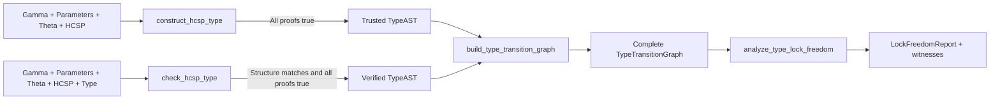

# Public API guide

This guide is for users calling the project without constructing internal ASTs
or judgments. The package root provides four stable application functions:

This page explains calls, return values, and exceptions. For the operations
performed during parsing, symbolic execution, Table 2/3 derivation, and proof,
see [Implementation semantics and the paper's rules](IMPLEMENTATION_SEMANTICS.md).

```python
from hcsp_typechecker import (
    construct_hcsp_type,
    check_hcsp_type,
    build_type_transition_graph,
    analyze_type_lock_freedom,
)
```

The functions construct Types from HCSP, check supplied Types, build Table 3
transition graphs from Types, and analyze lock freedom, Bottom errors, and
behavioral correctness on complete graphs. All accept
`output="none" | "result" | "full"`, with different inputs and successful results.

## 1. Data flow between the four interfaces



Construction and checking parse HCSP, Gamma, Theta, and parameters internally;
they do not return Process ASTs. Graph construction accepts an existing formal
`TypeAST`, not HCSP or Type text. Lock analysis accepts a complete graph from interface 3.

| Function | Input | Successful return |
|---|---|---|
| `construct_hcsp_type` | Complete annotated HCSP source | Trusted `TypeAST` |
| `check_hcsp_type` | Complete source with a supplied `type` section | Verified supplied `TypeAST` |
| `build_type_transition_graph` | Formal `TypeAST` | Complete reachable `TypeTransitionGraph` |
| `analyze_type_lock_freedom` | Complete transition graph | `LockFreedomReport`, with witnesses for failed properties |

The package root also exports the result and option types `TypeAST`,
`TypeTransitionGraph`, `LockFreedomReport`, and `OutputMode`; the exceptions
described in section 8; and `HCSPErrorDetail`, `TypeConstructionErrorKind`,
`TypeCheckingErrorKind`, `TypeTransitionGraphErrorKind`, and
`TypeLockAnalysisErrorKind` for structured error handling. Concrete AST
constructors and internal prover adapters have no stable import contract.

## 2. Minimal runnable examples

### 2.1 Construct a Type

```python
from hcsp_typechecker import construct_hcsp_type

source = """
gamma(x: Int)
theta(ch: channel(value: Int))
process {{ch?(x); ch!(x)}}
"""

type_ast = construct_hcsp_type(source, output="result")
```

A normal return means input parsing produced a Process AST, Table 2 produced
a complete Type, and every required FOL/dL obligation was proved `true`.

### 2.2 Check a supplied Type

```python
from hcsp_typechecker import check_hcsp_type

typed_source = """
gamma(x: Int)
theta(ch: channel(value: Int))
process {{ch?(x); ch!(x)}}
type forever interrupt angelic {
    ch? -> forever interrupt angelic {
        ch! -> empty
    }
}
"""

checked = check_hcsp_type(typed_source, output="result")
```

The checker consumes the supplied Type directly as rule conclusions, rather
than constructing a second complete tree for comparison. The returned `checked`
is the formal AST parsed from the `type` section.

### 2.3 Build a transition graph

```python
from hcsp_typechecker import build_type_transition_graph

graph = build_type_transition_graph(type_ast, output="result")
print(graph.initial_state)
print(len(graph.states), len(graph.transitions))
```

The graph interface performs one-way normalization and equi-recursive state
quotienting, then computes the complete reachable closure under Table 3's
critical-deadline reduction.

### 2.4 Analyze the graph

```python
from hcsp_typechecker import analyze_type_lock_freedom

report = analyze_type_lock_freedom(graph, output="result")
print(report.lock_free, report.error_free, report.behavior_correct)
```

The single component above has no communication partner, so analysis reports a
deadlock witness. This is a normal property result. The next example provides
a synchronized, lock-free execution.

### 2.5 Construct and analyze a parallel program

This complete example requires no KeYmaera X configuration:

```python
from hcsp_typechecker import (
    construct_hcsp_type,
    build_type_transition_graph,
    analyze_type_lock_freedom,
)

parallel_source = """
gamma(x: Int)
theta(ch: channel(value: Int))
process {
    {ch?(x)},
    {ch!(1)}
}
"""

parallel_type = construct_hcsp_type(parallel_source, output="result")
parallel_graph = build_type_transition_graph(
    parallel_type, max_states=10_000, max_transitions=50_000, output="result"
)
parallel_report = analyze_type_lock_freedom(parallel_graph, output="result")
assert parallel_report.lock_free
assert parallel_report.behavior_correct
```

## 3. Constructor interface

```text
construct_hcsp_type(
    source: str,
    *,
    source_name: str = "<input>",
    initial_states=None,
    path_condition: str | bool = True,
    output: OutputMode | str = "none",
    stream=None,
    z3_timeout_ms: int = 5000,
    keymaerax_timeout_seconds: float | None = None,
) -> TypeAST
```

### 3.1 `source`

Constructor input has this fixed form:

```ebnf
constructor_source ::= gamma [parameters] theta process EOF
```

The smallest input is `gamma() theta() process {{skip}}`. Sections mean:

| Section | Purpose | Required? |
|---|---|---|
| `gamma(...)` | Scalar state types and permitted ODE left-hand-side variable sets | Yes; may be empty |
| `parameters(...) where(H)` | Shared read-only parameters and background constraint | No |
| `theta(...)` | Channel slots, binders, and joint refinements | Yes; may be empty |
| `process {...}` | One or more sequential components; multiple components run in parallel | Yes; nonempty |

See [Context syntax](GAMMA_THETA_INPUT_SYNTAX.md) and
[Process/expression syntax](HCSP_INPUT_SYNTAX.md) for the complete grammars.

### 3.2 `initial_states`

Initial states are partial assignments to Gamma scalars; not every variable needs a value:

```python
# One top-level Process.
single_source = "gamma(x: Int, ready: Bool) theta() process {{skip}}"
construct_hcsp_type(single_source, initial_states={"x": 0, "ready": False})

# Two parallel components, in the order of process { {P1}, {P2} }.
parallel_source = "gamma(x: Int, y: Int) theta() process {{skip}, {skip}}"
construct_hcsp_type(parallel_source, initial_states=({"x": 0}, {"y": 1}))
```

Keys must be Gamma variables of type `Bool/Nat/Int/Rational/Real`. Unknown names,
parameters, and `continuous(...)` labels are invalid state keys. For parallel
input, the mapping count must exactly match the top-level component count;
the interface does not infer how to split a global state.

### 3.3 `path_condition`

Path conditions accept Python `True/False` or project expression strings:

```python
parameter_source = """
gamma(x: Real)
parameters(limit: Real) where(limit >= 0)
theta()
process {{skip}}
"""

construct_hcsp_type(
    parameter_source,
    initial_states={"x": 0},
    path_condition="x >= 0 and x <= limit",
)
```

Strings use the same strict expression parser as HCSP formulas and may reference
Gamma scalars and shared parameters. Syntax errors raise `HCSPInputError`.
A non-string, non-bool argument, such as a list, raises `TypeError`.

### 3.4 Success, refutation, and unresolved proofs

The constructor uses three-valued proof results with distinct public outcomes:

| Internal verdict | Complete Type? | Public behavior |
|---|---:|---|
| `true` | Yes | Return trusted `TypeAST` |
| `false` | Either | Raise `HCSPTypeConstructionError` |
| `unknown` | No | Raise `HCSPTypeConstructionError` |
| `unknown` | Yes | Raise `HCSPUntrustedTypeConstructionError`; candidate in `untrusted_type` |

After an `unknown` proof, construction records the obligation and continues
deriving rules, potentially forming a complete candidate. The candidate is for
review or further proof, not a verified successful return value.

## 4. Checker interface

```text
check_hcsp_type(
    source: str,
    *,
    source_name: str = "<input>",
    initial_states=None,
    path_condition: str | bool = True,
    output: OutputMode | str = "none",
    stream=None,
    z3_timeout_ms: int = 5000,
    keymaerax_timeout_seconds: float | None = None,
) -> TypeAST
```

Arguments match construction, but the source must end with a `type` section:

```ebnf
checking_source ::= gamma [parameters] theta process type EOF
```

See [Supplied Type syntax](TYPE_INPUT_SYNTAX.md). In particular:

- Each current-level `internal` branch requires parentheses, defining its
  corresponding Process branch.
- `angelic { ... }` may be empty or have one or more ordered communication branches.
- `empty` is normal empty communication behavior; `bottom` is an unreachable
  continuation. They are not interchangeable.
- Parallel Type component count and order must match top-level Process components.
- The checker does not use associativity or commutativity to search alternative grouping.

After an `unknown` proof, checking continues through the remaining Type structure
where possible. If structure matches and no definite failure overrides the
unresolved proof, it raises `HCSPTypeCheckingError(kind="proof-unknown")`.
A later mismatch or refuted premise instead determines the final error category.
Checking does not construct and deliver a new untrusted Type.

## 5. Transition graph interface

```text
build_type_transition_graph(
    type_ast: TypeAST,
    *,
    max_states: int | None = None,
    max_transitions: int | None = None,
    output: OutputMode | str = "none",
    stream=None,
) -> TypeTransitionGraph
```

### 5.1 Result object

The immutable `TypeTransitionGraph` contains:

| Field/method | Meaning |
|---|---|
| `initial_state: int` | Initial state identifier |
| `states: tuple[TypeState, ...]` | Consecutively numbered states `0..n-1` |
| `transitions: tuple[TypeTransition, ...]` | All deduplicated reachable edges |
| `outgoing(state_id)` | Outgoing edges in stable order |

`state.type_ast` is a normalized display AST. `edge.label` is a zero-time `tau`
or a timed label with an exact duration and ready set. `edge.derivations`
retains every distinct Table 3 derivation for the same source/label/target.
The graph contains no property verdicts; interface 4 produces those separately.

### 5.2 Size limits

```python
graph = build_type_transition_graph(
    type_ast,
    max_states=10_000,
    max_transitions=50_000,
)
```

Limits are strictly positive integers or `None`. If construction would exceed
a limit, it raises `HCSPTypeTransitionGraphError(kind="size-limit")` without
returning a partial graph. An unexplored prefix cannot be mistaken for the full state space.

## 6. Lock-freedom analysis interface

```text
analyze_type_lock_freedom(
    graph: TypeTransitionGraph,
    *,
    output: OutputMode | str = "none",
    stream=None,
) -> LockFreedomReport
```

The report exposes `deadlock_free`, `livelock_free`, `lock_free`, `error_free`, and
`behavior_correct`; the last is exactly `lock_free and error_free`.
False properties return normally, with finite witnesses in `deadlock_witness`,
`livelock_witness`, or `bottom_error_witness`. Invalid/incomplete input raises
`HCSPTypeLockAnalysisError`. See [Lock and Bottom-error analysis](TYPE_LOCK_ANALYSIS.md)
for definitions, algorithms, and complexity.

These properties concern the supplied Type graph. The graph and analysis
interfaces do not carry or recheck the Type's proof provenance. To apply the
result to the original HCSP program, use a Type returned successfully by
construction or checking. Analyzing an `error.untrusted_type` candidate can help
inspection, but does not establish verified behavior of the source program.

## 7. Output modes

All four interfaces share the presentation contract:

| `output` | Content | Typical use |
|---|---|---|
| `"none"` | No printing | Library calls, tests, web services |
| `"result"` | Final verdict, Type, graph size or behavioral summary, primary error | Ordinary command-line runs |
| `"full"` | Original input, derivation/proof trace, full graph or witness paths | Review and debugging |

`stream` accepts any writable text stream with `write()`:

```python
from io import StringIO

buffer = StringIO()
type_ast = construct_hcsp_type(source, output="full", stream=buffer)
audit_log = buffer.getvalue()
```

`output="none"` prints nothing even on failure; exceptions still provide
`format_result()` and `format_full()`. Logs and error messages use English.
Use structured exception fields for program control flow.

## 8. Exception handling

```python
from hcsp_typechecker import (
    HCSPInputError,
    HCSPTypeConstructionError,
    HCSPUntrustedTypeConstructionError,
    HCSPTypeCheckingError,
    HCSPTypeTransitionGraphError,
)
```

### 8.1 Input errors

Core `HCSPInputError` fields are:

| Field | Meaning |
|---|---|
| `phase` | `lexical`, `syntax`, or `validation` |
| `kind` | `input-<phase>` |
| `source_name` | Source label supplied by the caller |
| `line`, `column` | One-based location |
| `offset` | Zero-based character offset |
| `found`, `expected` | Actual and expected tokens |

`format_diagnostic()` renders the source line and caret. Construction/checking
backends do not start after an input error.

### 8.2 Construction errors

`HCSPTypeConstructionError.kind` values are:

- `environment`: ill-formed Gamma, Theta, parameters, or path context.
- `derivation`: implemented rules cannot derive a complete Type from the Process.
- `proof-failed`: a required formula is refuted or has a trustworthy counterexample.
- `proof-unknown`: a required formula is unresolved by the trusted prover.

Public fields include `verdict`, `kind`, `phase`, `reason`, `rule`, `location`,
`details`, and `partial_types`. Catch the subclass first to access an untrusted candidate:

```python
try:
    type_ast = construct_hcsp_type(source)
except HCSPUntrustedTypeConstructionError as error:
    candidate = error.untrusted_type
    print(error.format_full())
except HCSPTypeConstructionError as error:
    print(error.kind, error.reason)
```

### 8.3 Checking errors

`HCSPTypeCheckingError.kind` is `environment`, `type-mismatch`, `rule-application`,
`proof-failed`, or `proof-unknown`. Beyond common fields, it provides:

- `expected_type`: the supplied Type AST.
- `type_mismatch_detected`: whether a definite structural mismatch was found.
- `type_structure_matched`: `True` for complete structural consumption, `False`
  for a definite mismatch, or `None` when an earlier environment/rule failure stopped checking.

### 8.4 Graph errors

`HCSPTypeTransitionGraphError.kind` is `invalid-type`, `invalid-limit`,
`normalization`, or `size-limit`. Size errors expose `limit_name/limit`; invalid
options expose `option_name/option_value`. The exception never contains a partial graph.

### 8.5 Lock-analysis errors

`HCSPTypeLockAnalysisError.kind` is `invalid-graph` or `incomplete-graph`, with
`phase`, `reason`, `state_count`, `transition_count`, and `details`. These errors
describe invalid analysis inputs. Deadlock/livelock findings return a
`LockFreedomReport` with witnesses normally.

### 8.6 `HCSPErrorDetail`

Construction/checking `details` is a tuple of `HCSPErrorDetail` records, each with
`category/verdict/message/rule/location`. Proof errors additionally have
`proof_kind/formula/backend_detail`. These stable structured fields support
programmatic handling without parsing complete logs.

Invalid Python argument shapes can also raise `TypeError` or `ValueError`.

### 8.7 Handling failures in an application

| Condition | Meaning | Caller action |
|---|---|---|
| Input/environment/rule error | The source or typing premises cannot be accepted | Correct the reported source, declaration, state, or rule premise before retrying |
| `proof-failed` | A required formula was refuted | Inspect the formula and counterexample; revise the program or annotation |
| `proof-unknown`, complete candidate | Structure was derived, but verification is incomplete | Retain `untrusted_type` for inspection; configure or retry the prover before claiming success |
| `proof-unknown`, no complete candidate | Verification or translation could not proceed far enough | Inspect `reason` and `details`; repair the dependency or backend issue and retry |
| Graph size limit | The full reachable graph was not constructed | Increase the limit if resources permit; no partial graph is returned |
| A false behavioral property | Analysis completed and found a witness | Inspect the report's witness and revise the behavior |

Only continue the ordinary construction-to-graph-to-analysis pipeline after
construction or checking returns normally. `partial_types` records completed
components for diagnostics; it is not a successful type for the whole program.
Never substitute `empty` or `bottom` for a failed or unresolved derivation.
`unknown` means no verified conclusion was obtained, not that the program is
necessarily incorrect. A later definite mismatch or refutation overrides an
earlier unresolved proof in the final error category.

Result output counts only active proof obligations. Unselected ODE attempts
remain in the full log and are explicitly marked as excluded from the verdict.
Checking output uses `Check result : unverified` for `unknown`, while keeping
the structural matching status separate.

## 9. Provers and `unknown`

Z3 handles expression, state, and FOL obligations; KeYmaera X handles nontrivial
ODE dL obligations. Without KeYmaera X, discrete programs still work, but
obligations requiring the dL backend generally become `unknown`.
Z3 is a required dependency: if it is missing, translation and rule derivation
stop with `proof-unknown` and no complete candidate, rather than an input error.

See [Environment configuration](ENVIRONMENT_SETUP.md) for setup commands,
the full environment-variable table, and dependency diagnostics.

`keymaerax_timeout_seconds` overrides the timeout for one call; other settings
come from the environment. Missing provers, timeouts, or unreliable translation
conservatively yield `unknown`, never an assumed true result.
Z3 query failures, external process failures, conflicting prover statuses, and
unrecognized status text also yield `unknown` with diagnostic evidence. A
KeYmaera X `PROVED` status is accepted only after a normal process exit with no
conflicting or interrupted status; a captured status from a timed-out process
does not establish either proof or refutation.

`z3_timeout_ms` must be an integer in `0..4294967295`; `0` explicitly disables
the Z3 timeout. Booleans, strings, and fractional values raise `TypeError`;
out-of-range integers raise `ValueError`. The default is 5000 milliseconds per
query. `keymaerax_timeout_seconds` must be a finite positive number, excluding
Booleans. Invalid timeout arguments are configuration errors, rather than
unresolved mathematical obligations.

## 10. Input restrictions at a glance

- User identifiers use ASCII `[A-Za-z_][A-Za-z0-9_]*` and cannot be reserved words.
- Basic types are `Bool/Nat/Int/Rational/Real`.
- Gamma variables are scalar; `continuous(...)` registers an entire ODE left-hand-side set.
- Channels have at least one slot. Multiple slots carry separate scalars in one synchronization.
- Shared parameters are read-only: assignment, input binding, and continuous evolution cannot modify them.
- Every ODE requires `delay`; `safety` and `interrupt` are optional.
- The implicit ODE clock `t` is outside Gamma and cannot be a `dot` left-hand side.
- `wait(d)` is unsupported; use an explicit empty-flow ODE.
- Construction/checking frontend and backend paths use explicit work stacks.
  Tests cover 2000 sequential statements, 1500 nested Type continuations, 300
  parallel components, and a constructed 180-level communication Type passed
  back to checking/graph construction. These are tested baselines, not hard limits.
- Graph state spaces can still grow combinatorially; set `max_states/max_transitions`
  to suit the application.

## 11. Further reading

- [Complete input environment syntax](GAMMA_THETA_INPUT_SYNTAX.md)
- [Process and expression syntax](HCSP_INPUT_SYNTAX.md)
- [Supplied Type syntax](TYPE_INPUT_SYNTAX.md)
- [TypeConstructor rules](TYPE_CONSTRUCTOR.md)
- [TypeChecker rules](TYPE_CHECKER.md)
- [Table 3 graph implementation](TYPE_OPERATIONAL_SEMANTICS.md)
